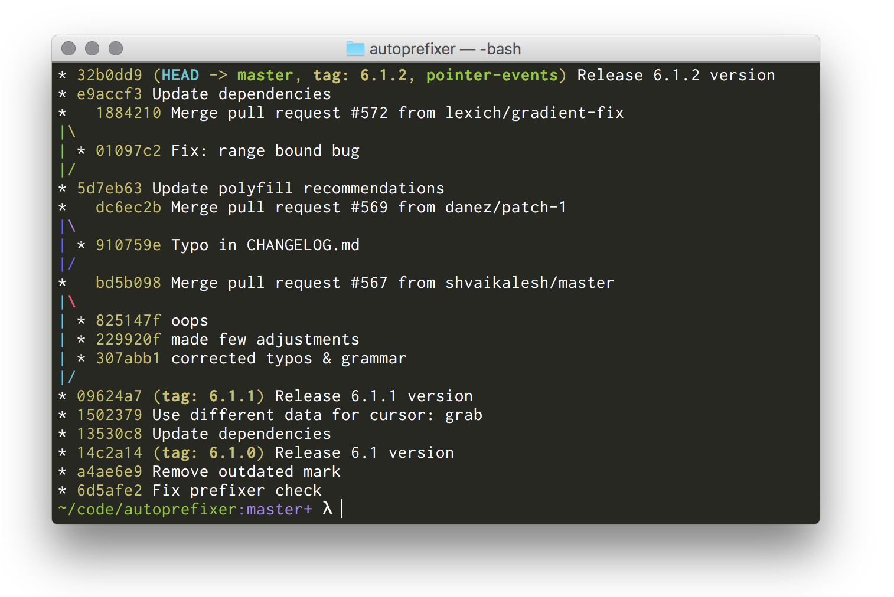

# monokai.terminal
The Monokai color scheme for OS X Terminal and iTerm

## How to install

1. Clone the repository `git clone git://github.com/stephenway/monokai.terminal.git`
2. Open the `Monokai.terminal` or `Monokai.itermcolors` file to install.
3. Optionally open up Terminal or iTerm  preferences for more options.

## License
This project is licensed under the MIT [license](LICENSE).

## Credit
Monokai Terminal and iTerm theme created by [Stephen Way](https://github.com/stephenway).
The Monokai color scheme was created by Wimer Hazenberg, http://monokai.nl
